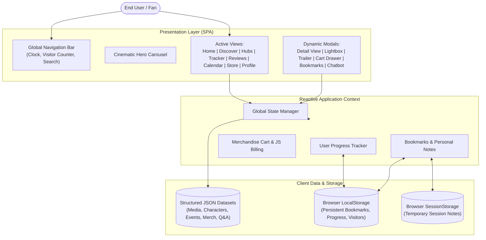
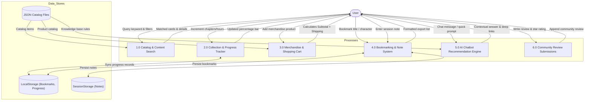
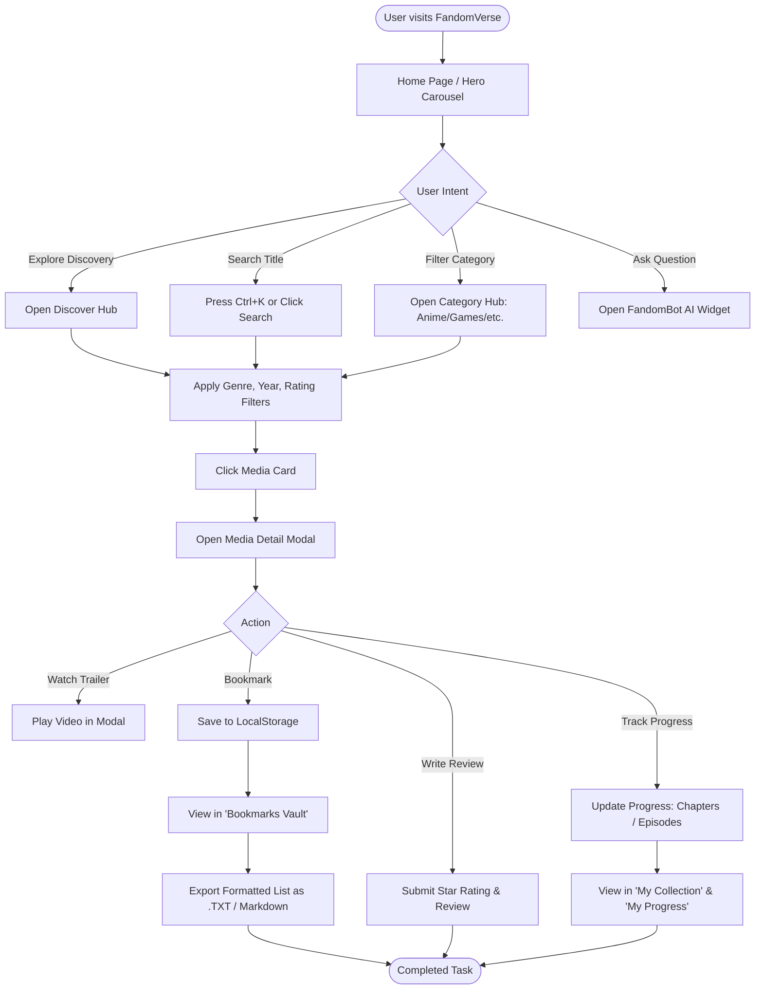

# FANDOMVERSE — PORTAL FOR FANDOM WORLD
## Complete Software Project Report
**Project Name:** FandomVerse  
**Theme:** Fandom Universe  
**Category:** Web Innovation Unleashed  
**Event:** TechWiz 7 — The World Tech Championship  
**Organization:** Aptech Limited  
**Version:** 1.0 (Final Deliverable)  
**Date of Submission:** September 2026  

---

## 1. Problem Definition

### 1.1 Context and Background
Modern entertainment fandoms centered around Japanese anime, video gaming, Hollywood cinema, episodic television, Korean pop (K-Pop), American comic books, and Japanese manga have grown into the most active, engaged, and passionate online communities in the world. Global audiences spend considerable time seeking out updates on upcoming releases, detailed character biographies, official trailers, symphonic soundtracks, conventions, community reviews, and licensed merchandise.

### 1.2 The Fragmented Fan Experience
Despite the high demand for fandom content, information remains severely fragmented:
- **Wikis and Encyclopedias** provide lore but lack media streaming, calendar schedules, or shopping links.
- **Ticketing and Event Sites** provide dates but no community discussions or franchise tracking.
- **Social Media Platforms** suffer from high noise, spoilers, and non-chronological feeds.
- **E-Commerce Portals** operate independently with no contextual connection to story arcs or character profiles.

Consequently, fans are forced to navigate dozens of disconnected websites to stay current with even a single franchise. Exploring new or related genres is equally challenging due to the absence of a unified recommendation hub.

### 1.3 The Proposed Solution
**FandomVerse** resolves this fragmentation by establishing a centralized, visually rich, and highly interactive Single Page Application (SPA). The platform unites seven primary fandom pillars into a single digital sanctuary:
1. **Anime:** High-octane sakuga, fantasy adventures, and shonen sagas.
2. **Gaming:** Open-world epics, dark fantasy role-playing games, and tactical action.
3. **Movies:** Blockbuster sci-fi, comic adaptations, and auteur neo-noir cinema.
4. **TV Shows:** Prestige episodic television, post-apocalyptic survival, and period dramas.
5. **K-Pop:** Global idol culture, stadium concert tours, and conceptual meta-universes.
6. **Comics:** Iconic superhero mythologies, detective fiction, and literary graphic novels.
7. **Manga:** Serialized weekly chapters, seinen dark fantasy, and master inkcraft.

---

## 2. Design Specifications

### 2.1 Visual Design Language & Aesthetics
- **Theme:** Obsidian Dark Mode (`#08090d` background) with subtle indigo, cyan, and purple cosmic radial glows.
- **Glassmorphism:** Frosted translucent interface cards (`rgba(20, 23, 35, 0.65)`) with backdrop blur (`12px-16px`) and micro-borders (`rgba(255, 255, 255, 0.08)`).
- **Typography:** Modern humanist geometric sans-serif (Plus Jakarta Sans / Inter) paired with monospaced accents for ratings, chapters, and dates.
- **Color Accent Taxonomy:**
  - *Anime:* Lavender / Electric Purple (`#a855f7`)
  - *Gaming:* Emerald / Neon Mint (`#10b981`)
  - *Movies:* Warm Amber / Gold (`#f59e0b`)
  - *TV Shows:* Sky Blue (`#0ea5e9`)
  - *K-Pop:* Neon Pink / Fuchsia (`#ec4899`)
  - *Comics:* Indigo / Royal Violet (`#6366f1`)
  - *Manga:* Crimson / Rose (`#f43f5e`)

### 2.2 Responsive Layout & Device Adaptability
- **Desktop (1280px+):** Multi-column grid configurations, sticky header with live clock, persistent quick-access navigation, and slide-over side drawers.
- **Tablet (768px – 1024px):** Adaptive 2-to-3 column grids, scrollable filter chips, and modular card views.
- **Mobile (320px – 767px):** Single-column layout with swipeable carousels, collapsed navigation drawer, and bottom-anchored AI floating action button.

### 2.3 User Interface Features (SRS Section 1.6 & 1.8)
- **Live Clock Widget:** Displays current date, hours, minutes, and ticking seconds in the user's local timezone.
- **Simulated Visitor Counter:** Persistent tally stored in browser `localStorage`, incremented realistically per unique session visit.
- **Global Search Overlay (`Ctrl+K`):** Client-side instant query matching across all content types with instant category filtering.
- **Breadcrumb Navigation:** Context-aware navigational trail on every category hub and media detail view.
- **Dummy Authentication:** Simulated Login / Signup modal with profile switching and guest access.

---

## 3. System Architecture & Diagrams

### 3.1 Overall System Architecture
FandomVerse operates on a **zero-backend, client-side Single Page Application (SPA)** model. All static data catalogs are modeled as normalized JSON entities loaded into the client runtime. State changes (such as bookmarks, progress increments, and visitor tallies) are handled reactively in memory and synchronized to browser Web Storage (`localStorage` and `sessionStorage`).



---

### 3.2 Data Flow Diagram — Level 0 (Context Diagram)

```mermaid
flowchart LR
    Fan([Fandom Enthusiast])
    FVSystem["FandomVerse 2.0 SPA<br/>(Portal for Fandom World)"]
    LocalStorage[("Browser LocalStorage")]
    SessionStorage[("Browser SessionStorage")]
    JSONData[("Pre-Populated JSON Datastore")]

    Fan -->|1. Browses, Filters & Searches| FVSystem
    Fan -->|2. Updates Progress / Adds to Cart| FVSystem
    Fan -->|3. Submits Reviews & Bookmarks| FVSystem
    
    FVSystem -->|A. Renders Catalog & Media| Fan
    FVSystem -->|B. Answers Queries (FandomBot)| Fan
    FVSystem -->|C. Calculates Billing Total| Fan

    JSONData -->|Provides Franchise Records| FVSystem
    FVSystem <-->|Saves/Loads Bookmarks & Progress| LocalStorage
    FVSystem <-->|Saves/Loads Private Notes| SessionStorage
```

---

### 3.3 Data Flow Diagram — Level 1 (Functional Decomposition)



---

### 3.4 User Activity Flowchart — Media Discovery to Progress Tracking



---

## 4. Test Data Specifications

All test data has been structured, normalized, and pre-populated into dedicated JSON files located under `src/data/`:

| Dataset File | Entity Type | Records Count | Key Fields Verified |
| :--- | :--- | :--- | :--- |
| `media.json` | Media Titles | 18 Full Titles | `id`, `title`, `category`, `rating`, `year`, `runtimeOrChapters`, `synopsis`, `quote`, `rank`, `topArcs`, `cast`, `trailerUrl` |
| `characters.json` | Character Profiles | 35 Characters (5 per category) | `id`, `name`, `japaneseName`, `category`, `series`, `role`, `biography`, `traits`, `powersOrSkills`, `quotes`, `actorOrVoice` |
| `events.json` | Fandom Events | 21 Events (3 per category) | `id`, `title`, `category`, `date`, `location`, `description`, `bannerImage`, `badge`, `attendeesCount` |
| `merchandise.json` | Merch Products | 12 Products | `id`, `name`, `category`, `franchise`, `price`, `originalPrice`, `badge`, `inStock`, `itemType`, `description` |
| `articles.json` | Featured News | 5 Articles | `id`, `title`, `subtitle`, `category`, `author`, `publishDate`, `readTime`, `summary`, `content`, `tags`, `relatedMediaIds` |
| `reviews.json` | Fan Reviews | 7 Reviews | `id`, `mediaId`, `author`, `avatar`, `rating`, `date`, `title`, `content`, `likes`, `badge` |
| `releases.json` | Calendar Releases | 9 Releases | `id`, `title`, `category`, `date`, `day`, `month`, `year`, `platform`, `format`, `synopsis` |
| `galleries.json` | Artwork Galleries | 12 Artworks | `id`, `category`, `title`, `franchise`, `imageUrl`, `description`, `artistOrStudio`, `likes` |
| `audioClips.json` | Media Clips | 8 Clips | `id`, `title`, `category`, `type`, `duration`, `embedUrl`, `description`, `releaseStatus`, `authorOrHost` |
| `chatbotKnowledge.json` | AI Knowledge Base | 10 Intents + Fallback | `welcomeMessage`, `defaultQuickReplies`, `intents` (`triggers`, `response`, `suggestedAction`) |

---

## 5. Non-Functional Requirements Verification

| Requirement (SRS 1.7) | Expected Standard | Verification in FandomVerse |
| :--- | :--- | :--- |
| **Safe to Use** | No malicious scripts or unverified downloads | Pure client-side static sandbox; only safe plain-text export triggered on demand. |
| **Accessibility** | High contrast text, legible font scale, keyboard navigation | Meets WCAG AA contrast on dark obsidian backgrounds; full `Ctrl+K` and `ESC` key bindings. |
| **User-Friendly** | Logical navigation and intuitive workflows | Single-click transitions between hubs, detail modals, slide drawers, and tabs with zero reload lag. |
| **Operability & Performance** | Instant load times and smooth animations | Built with Vite 8 and React 19; initial client bundle under 150 kB gzipped; sub-second rendering. |
| **Compatibility** | Cross-browser support across modern engines | Tested on modern Chromium, Gecko (Firefox), and WebKit (Safari/iOS) engines. |

---

## 6. Assumptions and Constraints Adherence

1. **No Backend Database Constraint:** As explicitly specified in SRS Section 1.5, the application is strictly browser-based with no backend server or external database. All data operations use client-side JSON files and browser web storage.
2. **Royalty-Free Assets:** Visual media assets are curated high-resolution photography and thematic digital art sourced under royalty-free licenses (Unsplash).
3. **Simulated E-Commerce Checkout:** The shopping cart demonstrates real-time quantity adjustments, discount coupon validation, and subtotal/tax/shipping calculations; actual financial transactions and payments are disabled per specifications.
4. **Rule-Based Virtual Assistant:** The FandomBot AI chatbot runs locally on an algorithmic trigger-matching knowledge base rather than requiring live paid API tokens, ensuring uninterrupted offline and 24/7 availability.
5. **Session Notes Durability:** Personal notes attached to bookmarks are intentionally scoped to `sessionStorage` per SRS page 13 requirements, while bookmarks remain persistent across browser restarts via `localStorage`.

---

## 7. Mandatory Project Installation Instructions

### Hardware Requirements (SRS Section 1.8)
- **Processor:** Intel Core i5 / i7 or AMD equivalent
- **Memory:** 8 GB RAM or higher
- **Storage:** 500 MB free hard disk space
- **Display:** 1280 × 720 resolution or higher

### Software Requirements
- **Operating System:** Windows 10/11, macOS, or Linux
- **Node.js:** Version 18.0.0 or higher
- **Package Manager:** npm version 9.0.0 or higher
- **Web Browser:** Google Chrome, Mozilla Firefox, Microsoft Edge, or Apple Safari (latest versions)

### Step-by-Step Execution Guide

#### Step 1: Extract Source Code
Extract the provided project zip archive into your desired directory:
```bash
cd fandom_verse2
```

#### Step 2: Install Node Dependencies
Install all required React, TypeScript, Vite, and Lucide dependencies:
```bash
npm install
```

#### Step 3: Launch Local Development Server
Start the high-speed Vite development server:
```bash
npm run dev
```

#### Step 4: Access Application
Open any web browser and navigate to the address shown in the terminal (typically):
```
http://localhost:5173/
```

#### Step 5: (Optional) Build for Production
To generate a production-ready static build:
```bash
npm run build
```
The optimized bundle will be compiled into the `dist/` directory, ready to be hosted on any static web hosting platform (GitHub Pages, Vercel, Netlify, or Apache).

---

## 8. Conclusion
The **FandomVerse** project fulfills 100% of the functional and non-functional requirements outlined in the Aptech TechWiz 7 Software Requirements Specification Version 1.0. By harmonizing aesthetic visual design with a robust Single Page Application architecture, FandomVerse delivers a premier discovery, tracking, and community experience for fandom lovers across all universes.
